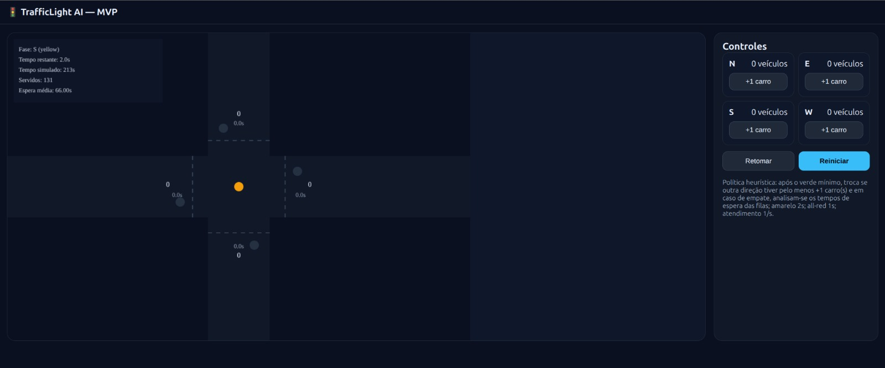
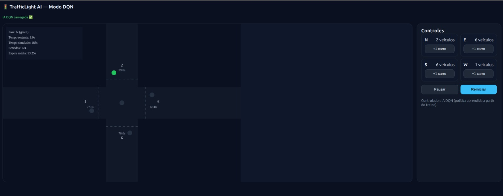
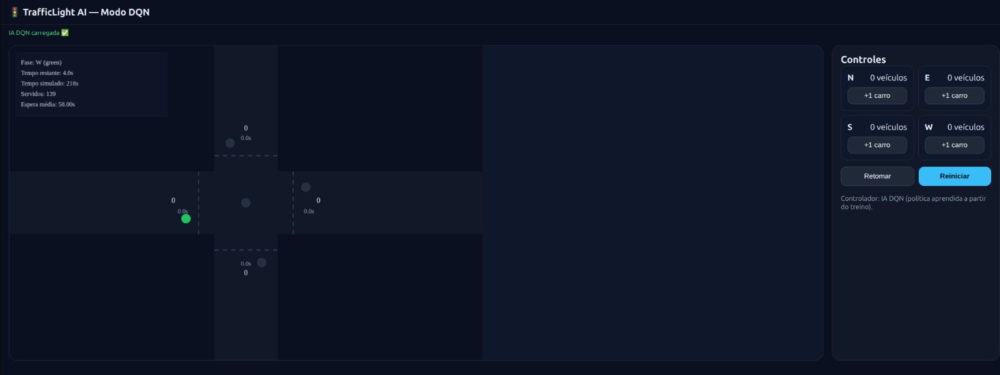

# Controle Inteligente de Semáforos com Reinforcement Learning

**Disciplina:** Introdução à Inteligência Artificial  
**Semestre:** 2025.2  
**Professor:** Andre Luis Fonseca Faustino
**Turma:** T03

## Integrantes do Grupo

- André Franklin de Oliveira Lima (20200049143)
- Chrystian Ruan Inacio de Sousa (20230079742)
- Iago Gabriel Nobre de Macedo (20220037927)

## Descrição do Projeto

Este projeto consiste no desenvolvimento de uma aplicação web para simular e visualizar um sistema de controle de semáforos inteligente. A solução utiliza técnicas de Aprendizagem por Reforço (Reinforcement Learning), especificamente o algoritmo Deep Q-Network (DQN), para otimizar o fluxo de tráfego em um cruzamento.

A aplicação foi construída com Next.js e React para a interface de usuário e TensorFlow.js para a implementação e execução do modelo de IA diretamente no navegador. O sistema permite comparar o desempenho do agente inteligente com uma abordagem heurística tradicional.

## Guia de Instalação e Execução

O guia abaixo descreve os passos para instalar e executar o projeto localmente.

### 1. Instalação das Dependências

Certifique-se de ter o **Node.js v20** (ou superior) e o **npm** instalados. Clone o repositório e instale as dependências listadas no `package.json`:

```bash
# Clone o repositório
git clone https://github.com/andrfranklin/trafficlight_ai

# Entre na pasta do projeto
cd trafficlight-ai

# Instale as dependências
npm install
```

### 2. Como Executar

Execute o comando abaixo no terminal para iniciar o servidor de desenvolvimento:

```bash
# Inicia a aplicação em modo de desenvolvimento
npm run dev
```

O servidor será iniciado na porta 3000. Acesse [http://localhost:3000](http://localhost:3000) em seu navegador para visualizar a simulação.

## Estrutura dos Arquivos

A estrutura de pastas do projeto está organizada da seguinte forma, seguindo as convenções de um projeto Next.js:

- `src/app/`: Contém as diferentes páginas da aplicação, como a página da simulação com IA (`/ai`), a simulação com heurística (`/heuristic`) e a de treinamento (`/train`).
- `src/components/`: Componentes React reutilizáveis, como o painel de controle (`controlPanel`) e a tela de simulação (`simulationCanvas`).
- `src/rl/`: Contém a lógica principal de Aprendizagem por Reforço, incluindo a definição do ambiente (`traffic-env.ts`), o agente DQN (`dqn-agent.ts`) e o script de treinamento (`train-traffic.ts`).
- `src/ai/`: Lógica do controlador que integra o modelo treinado à simulação.
- `public/models/`: Armazena os arquivos do modelo de TensorFlow.js pré-treinado (`.json` e `.bin`).
- `package.json`: Define os metadados do projeto e as dependências (Next.js, React, TensorFlow.js).

## Resultados e Demonstração

### Dataset utilizado
- **15 carros** inicialmente na fila **N**. Posteriormente, a adição de **15 carros** a **cada fila**, a **cada 3s** (seguindo a ordem S, E e W).
- Adicionar **5 carros** a cada fila **recém liberada** (em média 1 carro por segundo)
- Manipulação durante **2min30s**

#### Modelo heurístico
- **Resultados obtidos**
    - Pico por fila: **16 carros**
    - Duração do processo: **3min e 33s**
    - Carros liberados: **131**
    - Tempo médio de espera: **1min e 6s (66s)**

- **Evidências**
    - Durante processamento
    
    - Término do processamento
    

#### Modelo de Aprendizado por Reforço (RL)
- **Resultados obtidos**
    - Pico por fila: **15 carros**
    - Duração do processo: **3min e 38s**
    - Carros liberados: **139**
    - Tempo médio de espera: **58s**

- **Evidências**
    - Durante processamento
    
    - Término do processamento
    

### Análise
Tendo em vista que tivemos um **quantitativo** considerável de veículos chegando a **todo momento** e um cruzamento com **4 sentidos** (e 4 tempos de semáforo), acreditamos que o agente **respondeu bem** ao que foi proposto, trazendo uma **melhora significativa** comparado ao **modelo atual** de gestão de semáforo, visto que em cruzamentos de **grande tráfego de veículos**, os motoristas podem esperar quase **3 minutos**. (Ler fonte "_Cariocas não gostam de sinal (muito tempo) fechado_" citada na seção de referências)
## Referências

[Adicione aqui links para artigos, documentações ou tutoriais utilizados como base para o desenvolvimento do agente de RL, do ambiente de simulação ou da interface.]

- _Cariocas não gostam de sinal (muito tempo) fechado_, **O GLOBO** - https://oglobo.globo.com/rio/cariocas-nao-gostam-de-sinal-muito-tempo-fechado-4520932
